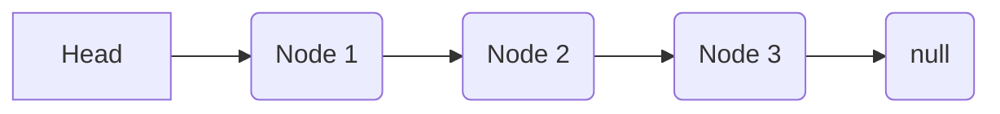

# Project: Linked Lists

`Time to complete: 5~ hrs`

`Yes this is AI generated, Thought AI README is better than no README as i had nothing to say`

This project provides a basic implementation of a singly linked list in JavaScript, based on the concepts taught in The Odin Project's curriculum on linked lists.

## What is a Linked List?

A linked list is a linear collection of data elements, called nodes, where each node points to the next node in the sequence. Unlike arrays, linked lists do not store elements in contiguous memory locations. This structure allows for efficient insertion and deletion of elements compared to arrays, but accessing elements by index is less efficient.

Here's a simple representation of a linked list:



## Project Structure

The implementation is split into two main files:

- `Node.js`: Defines the `Node` class, representing a single element in the linked list. Each node contains a `value` and a `next` property, which is a reference to the next node in the list.
- `LinkedList.js`: Defines the `LinkedList` class, which manages the sequence of nodes. It includes methods for common linked list operations.
- `main.js`: Provides a simple example of how to use the `LinkedList` class.

## `Node` Class

The `Node` class is a simple structure:

```javascript
export class Node {
  constructor(value = null) {
    this.value = value
    this.next = null
  }

  toString() {
    return `(${this.value}) -> ${this.next ? this.next.toString() : 'null'}`
  }
}
```

- `constructor(value = null)`: Initializes a new node with an optional `value` and sets the `next` pointer to `null`.
- `toString()`: Provides a string representation of the node and the subsequent nodes in the list.

## `LinkedList` Class

The `LinkedList` class provides the following methods:

- `append(value)`: Adds a new node containing `value` to the end of the list.
- `prepend(value)`: Adds a new node containing `value` to the start of the list.
- `size`: Returns the total number of nodes in the list.
- `head`: Returns the first node in the list.
- `tail`: Returns the last node in the list.
- `at(index)`: Returns the node at the given `index`.
- `pop()`: Removes the last element from the list.
- `contains(value)`: Returns `true` if the passed in `value` is in the list and otherwise returns `false`.
- `find(value)`: Returns the index of the node containing `value`, or `null` if not found.
- `insertAt(value, index)`: Inserts a new node with the provided `value` at the given `index`.
- `removeAt(index)`: Removes the node at the given `index`.
- `toString()`: Represents the LinkedList objects as strings in the format: `( value ) -> ( value ) -> ( value ) -> null`.

## Example Usage

You can see a simple example of how to use the `LinkedList` in `main.js`:

```javascript
import { LinkedList } from './LinkedList.js'
const list = new LinkedList()

list.append('dog')
list.append('cat')
list.append('parrot')
list.append('hamster')
list.append('snake')
list.append('turtle')

console.log(list.toString())
```

This code creates a new linked list, appends several animal names, and then prints the string representation of the list to the console.
